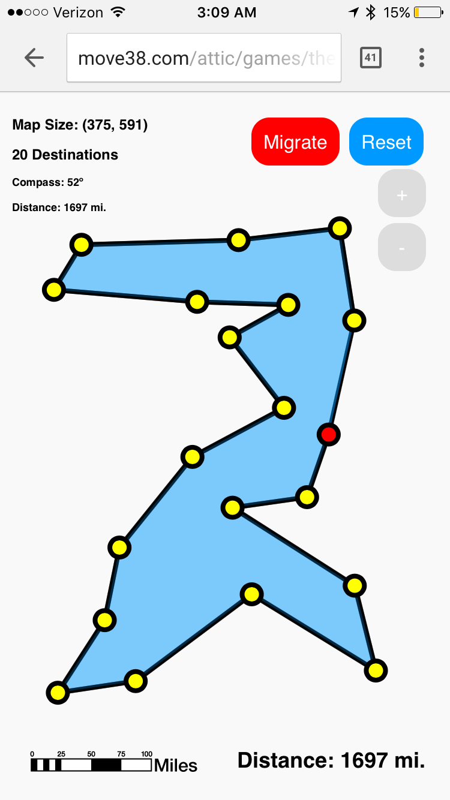
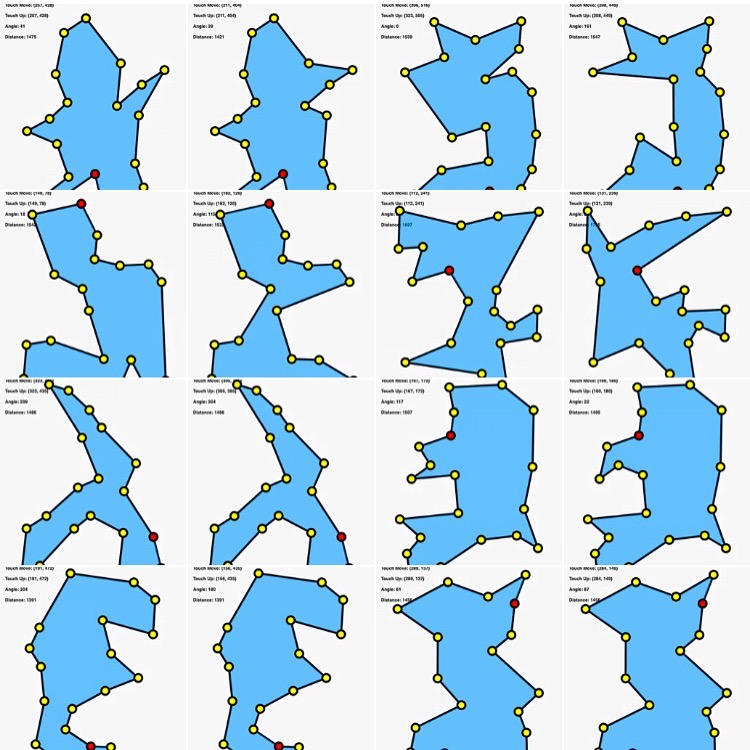

# The Traveler
The Traveler is a simple game, the idea being that you, "the traveler", need to visit a number of destinations and return home in, ideally, the shortest path possible. In the game, you will be given a number of destinations, and you can challenge others to find the shortest path possible. Take your time if you'd like, or race to see how quickly you can complete the trip. Note: you will only be scored on your travel distance.

## Play the game!
You can play The Taveler [here](http://move38.com/attic/games/theTraveler).

## Why is this interesting?
If you only have a few places to travel, this is a trivial problem for both people and computers; However, once the number of destinations becomes only slightly large, (i.e. > 20 destinations), the number of possible paths becomes exponentially difficult for a computer to solve. This is called the [Traveling Salesman Problem](https://en.wikipedia.org/wiki/Travelling_salesman_problem). While there are many clever [algorithms](https://en.wikipedia.org/wiki/Travelling_salesman_problem#Exact_algorithms) for solving this problem, it is thought to be NP-hard, meaning there is not an algorithm for which this problem can be solved in polynomial time. People, when shown a map of locations can approximate some very short, maybe not the shortest routes, without much thought. I hypothesize that having a dataset of people solving this problem could eventually lead to better machine learned algorithms for this subset of problems.

## Screenshots

